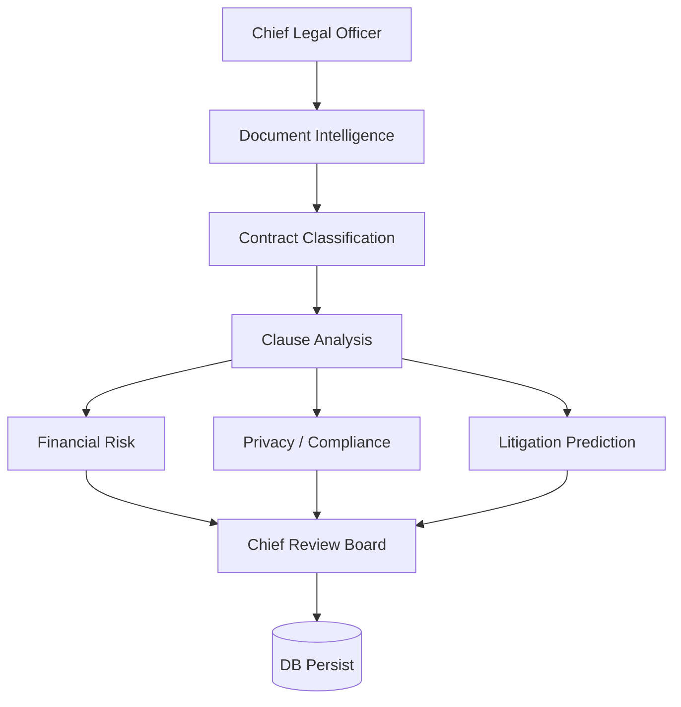

# LexGuard Swarm Plan — Stage 1 (Read-Only Analysis)

**Option (b):** Thin placeholder orchestration layer later — **not built in this stage**.  
**Constraint:** No business-logic changes. This document designs the architecture around existing services.

**Working root:** `C:\Users\BhaviChasvi\Downloads\lexguard`

---

## 1. Existing architecture (as implemented today)

### Entry point

| Layer | File | Behavior |
|-------|------|----------|
| Upload API | `backend/routers/analyze.py` | `POST /api/analyze/upload` → saves file → `BackgroundTasks.add_task(run_analysis_pipeline, contract.id, file_path)` |
| Status API | same router | `GET /api/analyze/status/{contract_id}` → `pending` / `processing` / `complete` / `failed` |
| Results | `backend/routers/contracts.py` | `GET /analyze/results/{contract_id}` |
| Pipeline | `backend/services/orchestrator.py` | `run_analysis_pipeline(contract_id, file_path)` — **single sequential coroutine** |

### Current pipeline (actual call order in `run_analysis_pipeline`)

```
1. DocumentParser.parse(file_path)                    # sync
2. RAGEngine.detect_contract_type(full_text)          # sync
3. extract_clauses_with_groq(full_text)               # async LLM → fallback RAGEngine.extract_clauses
4. score_clauses(raw_clauses, contract_type)          # sync — ALL categories in one pass
   compute_cri / classify_cri / counts                # sync
5. detect_contradictions(scored_clauses)              # sync
6. RAGEngine.generate_scenarios(scored_clauses)       # sync
7. groq_client.complete(SUMMARY_SYSTEM, …)            # async — executive summary
8. Persist Contract + Clause rows to DB               # async SQLAlchemy
```

**Today there is no agent layer, no parallel fan-out, and no swarm status store.** Steps 5 and 6 both depend only on `scored_clauses` but run **sequentially** — a real unused concurrency opportunity.

### Services and what they actually do

| Service | File | Role in pipeline | Not an agent today |
|---------|------|------------------|--------------------|
| Document parse + counterparty/jurisdiction heuristics | `parser.py` | Step 1 (+ metadata used later) | — |
| Contract-type keyword detect; RAG extract fallback; scenarios | `rag_engine.py` | Steps 2, 3-fallback, 6 | — |
| Groq JSON/text LLM | `groq_client.py` | Step 3 extract + Step 7 summary | — |
| Clause L×I scoring, CRI, risk tiers | `risk_scorer.py` | Step 4 (all categories together) | — |
| Pairwise contradiction auditor | `contradiction_detector.py` | Step 5 | — |
| Prompt strings | `prompts.py` | Used by orchestrator/Groq | — |
| DOCX/PDF export | `report_builder.py` | **Not in analysis pipeline** (export routes only) | Do **not** invent an analysis agent for this |
| Gemini client | `gemini_client.py` | Alternate LLM client; **not called by orchestrator today** | Out of swarm path unless we explicitly wire it later |

### Honest gap vs “multi-agent legal org”

LexGuard is a **solid sequential contract analyzer**. Risk scoring already tags clauses with categories (`Financial`, `Privacy`, `Employment`, …) inside one `score_clauses` pass — it is **not** three concurrent specialist services yet. Contradiction detection is a **separate** real module. Parallelism for Financial vs Privacy vs Litigation must be designed as **thin wrappers over existing outputs/functions**, not as fake renamed steps of the same monolith call.

---

## 2. Proposed OpenSwarm-shaped architecture (placeholder → swap later)

### Design principles (option b)

1. **Do not build a custom multi-agent framework.**  
2. Build a **thin placeholder** that mirrors the *shape* OpenSwarm/Agency-style agents expect: named agent, specialization, `run(input) → output`, status, reasoning, confidence, duration, dependencies.  
3. **Isolate orchestration in one module** so tomorrow we replace that module with official OpenSwarm Agents 1:1.  
4. **Existing services stay untouched** — agents only *call* them.  
5. Never claim OpenSwarm-native lifecycle/approval/visualization until the official SDK is wired.

### Target topology (AI Legal Organization)

```
Chief Legal Officer (coordinator only)
        │
        ▼
Document Intelligence Team          ← parser.py
        │
        ▼
Contract Classification Team        ← rag_engine.detect_contract_type
        │
        ▼
Clause Analysis Team                ← extract_clauses_with_groq / RAG fallback
        │                             (+ risk_scorer.score_clauses as scoring pass
        │                              owned here OR as shared prep — see §4)
        ▼
   ┌────┴─────────────────────────────┐
   │     REAL parallel fan-out        │  (all depend only on scored clauses)
   ▼                ▼                 ▼
Financial      Privacy /         Litigation
Risk Team      Compliance Team   Prediction Team
   │                │                 │
   └────┬───────────┴────────┬────────┘
        ▼
Chief Review Board                  ← synthesis + executive summary (Groq)
        │
        ▼
Persistence (not an “agent”)        ← existing DB write in orchestrator
```

**Negotiation Team:** **Do not add as a separate agent** for the demo unless we have spare time.  
Reason: `redline_suggestion` is already produced during clause extraction (`rag_engine` / Groq schema). A standalone “Negotiation Team” that only lists existing redlines would be a **pass-through** under judge questioning. Fold redline consolidation into **Chief Review Board** output (and keep export via existing `report_builder.py`).

---

## 3. Agent roster — responsibilities (legal-org naming)

| Agent name | Specialization (one line) | Wraps existing logic (call only) | Distinct work? |
|------------|---------------------------|----------------------------------|----------------|
| **Chief Legal Officer** | Coordinates the matter workflow; does not analyze clauses itself | Placeholder planner: defines run order / dependency DAG; no LLM required | Yes — coordination only |
| **Document Intelligence Team** | Extracts text, layout cues, counterparty, jurisdiction | `DocumentParser.parse` | Yes — real parse |
| **Contract Classification Team** | Classifies agreement type for weighting/routing | `RAGEngine.detect_contract_type` | Yes — real keyword classify |
| **Clause Analysis Team** | Extracts risky clauses + plain English + initial L/I + redlines | `extract_clauses_with_groq` → fallback `RAGEngine.extract_clauses`; then `score_clauses` | Yes — heaviest real work |
| **Financial Risk Team** | Quantifies liability / payment / LoL exposure from Financial-category clauses | Filter scored clauses where `category == "Financial"`; aggregate using existing score fields / optional `compute_cri` on subset | Yes — **subset analysis**, not a second full extract. Weak if we only “echo” counts with no rationale — must emit financial brief + top exposures |
| **Privacy / Compliance Team** | Surfaces privacy, confidentiality, compliance obligations | Filter `Privacy` / `Compliance` (and RAG’s `"Privacy & Security"` if present); aggregate + brief | Yes — same bar as Financial |
| **Litigation Prediction Team** | Finds internal contradictions that create dispute risk | `detect_contradictions(scored_clauses)` | Yes — **strongest distinct module** |
| **Chief Review Board** | Merges specialist findings; signing recommendation; Stage-3 cross-rule; executive summary | Consumes all team outputs; calls `groq_client.complete` for summary; applies bump rule (Stage 3) | Yes — synthesis, not concat-only |

**Scenarios:** `RAGEngine.generate_scenarios` is real logic. Options (pick in Stage 2):

- **A (preferred for honesty):** Run scenarios **inside Chief Review Board** (after specialists), or  
- **B:** Run scenarios **in parallel with Litigation** (both need only scored clauses) as part of Litigation/Review prep — but **do not** invent a 9th “Scenario Team” unless we name it accurately and show distinct UI status.

Recommend **A** to keep the visible roster = CLO + 3 sequential + 3 parallel + Review Board (8 names max, all defensible).

---

## 4. Agent input / output contracts

Shared envelope (placeholder Agent Result — mirrors what OpenSwarm swap should preserve):

```text
AgentResult {
  name: str
  specialization: str
  status: pending | running | completed | failed
  input: dict
  output: dict
  reasoning: str          # plain-English why
  confidence: float       # 0–1, honest heuristic (not fake precision)
  duration_ms: float
  dependencies: list[str] # agent names that must complete first
}
```

### Per-agent I/O (tied to real types in code)

#### Chief Legal Officer
- **In:** `{ contract_id, file_path }`
- **Out:** `{ plan: [agent_names in waves], waves: [[...],[...],...] }`
- **Reasoning:** “Matter opened; sequential intake then parallel risk specialists.”

#### Document Intelligence Team
- **In:** `{ file_path, upload_dir }`
- **Out:** `{ full_text, page_count, chunks, bounding_boxes, counterparty, jurisdiction }`  
  (= fields of `ParsedDocument`)
- **Confidence:** high if `full_text` non-empty; fail if empty (same as today)

#### Contract Classification Team
- **In:** `{ full_text }`
- **Out:** `{ contract_type: str }`  
  (= `detect_contract_type` return)
- **Depends on:** Document Intelligence

#### Clause Analysis Team
- **In:** `{ full_text, contract_type }`
- **Out:** `{ raw_clauses, scored_clauses, cri, risk_level, high_count, moderate_count, low_count }`  
  via `extract_clauses_with_groq` + `score_clauses` + `compute_cri` + `classify_cri`
- **Depends on:** Classification (needs `contract_type` for weighting)
- **Note:** Scoring stays in this team so Financial/Privacy teams receive **already scored** clauses (matches today’s data dependency). Do **not** triple-call `score_clauses` on the full set in parallel — that would be wasted duplicate work, not meaningful parallelism.

#### Financial Risk Team
- **In:** `{ scored_clauses, contract_type }`
- **Out:** `{ financial_clauses, financial_cri_or_contrib, top_exposures[], reasoning }`
- **Depends on:** Clause Analysis only
- **Rules for “real work”:** Must filter + summarize liability/payment/LoL; cite clause types and scores. If zero Financial clauses → say so explicitly (still valid work).

#### Privacy / Compliance Team
- **In:** `{ scored_clauses, contract_type }`
- **Out:** `{ privacy_compliance_clauses, top_issues[], reasoning }`
- **Depends on:** Clause Analysis only
- **Category matching:** Handle both schema values `Privacy` / `Compliance` and RAG map value `"Privacy & Security"`.

#### Litigation Prediction Team
- **In:** `{ scored_clauses }`
- **Out:** `{ contradictions: list[{clause_a, clause_b, category, description, severity}] }`  
  (= `detect_contradictions` return)
- **Depends on:** Clause Analysis only

#### Chief Review Board
- **In:** `{ contract_type, counterparty, jurisdiction, scored_clauses, cri, risk_level, counts, financial_out, privacy_out, litigation_out }`
- **Out (extends today’s persisted fields):**  
  - `executive_summary` (Groq, same as today)  
  - `scenarios` (from `generate_scenarios`)  
  - `signing_recommendation` (Stage 3)  
  - `final_risk_score` / effective adjustments (Stage 3 cross-rule)  
  - `what_changed[]` vs specialist findings (Stage 3)  
  - redline shortlist from high-risk clauses (folded negotiation)
- **Depends on:** all three parallel teams (+ Clause Analysis artifacts)

#### Persistence (infrastructure, not a swarm agent)
- Same DB write as current Step 9 — remains in `run_analysis_pipeline` signature owner so **routers unchanged**.

---

## 5. Dependency graph (honest)



### Concurrent vs sequential — Q&A-ready answers

| Step | Concurrent? | Why |
|------|-------------|-----|
| DI → CC → CA | **No** | Each needs prior output (`file`→`text`→`type`→`clauses`) |
| FR \|\| PC \|\| LP | **Yes — real** | All three need only `scored_clauses` (+ type for FR/PC weighting). No cross-dependencies among them |
| CRB | **No** | Needs all three specialist outputs + scores for synthesis / Stage-3 bump |
| Scenarios vs contradictions | **Could** run in parallel today (both need scored clauses) — we fold scenarios into CRB to avoid a hollow 9th agent |

**What is *not* parallel (do not claim it):**  
Parsing vs classification; classification vs extraction; “three risk teams each re-extracting the contract.”

---

## 6. Parallel execution opportunities (only real ones)

1. **Primary demo wow:** After Clause Analysis completes, run **Financial Risk**, **Privacy/Compliance**, and **Litigation Prediction** with `asyncio.gather` (placeholder) / OpenSwarm parallel primitive (later).  
2. **Optional micro-parallel inside Clause Analysis (do not surface as agents):** today’s `extract_clauses_with_groq` already dual-chunks long docs with two sequential awaits — could gather chunk A/B; keep internal, don’t invent “Chunk Agent Alpha.”  
3. **Unused today:** `detect_contradictions` ∥ `generate_scenarios` — absorb scenarios into CRB rather than a new agent.

---

## 7. Future OpenSwarm integration points

| Placeholder concept | Tomorrow’s 1:1 swap target | Isolation |
|---------------------|----------------------------|-----------|
| `PlaceholderAgent(name, specialization, run_fn, dependencies)` | Official OpenSwarm / Agency `Agent` | Same name + specialization strings |
| `PlaceholderSwarm.run(waves)` | OpenSwarm agency / team runner | **Single module only** |
| `AgentResult` envelope | Map to OpenSwarm message/state objects | Stable dict schema for UI polling |
| Status store `analysis_id → team → status` | OpenSwarm native visualization if available; else keep our poll API | Stage 4 |

**Proposed single orchestration module (Stage 2 — not created yet):**

```text
backend/swarm/orchestrator_bridge.py   # ONLY place that sequences agents
backend/swarm/agents/*.py              # thin wrappers: call existing services
backend/swarm/types.py                 # AgentResult envelope
```

`backend/services/orchestrator.py` keeps **external signature**:

```python
async def run_analysis_pipeline(contract_id: str, file_path: str):
```

Stage 2 change inside that function: delegate body to `orchestrator_bridge.run_matter(...)`, then persist exactly as today — **routers untouched**.

**Labeling rule for demo copy:** UI may say “AI Legal Organization (OpenSwarm-ready adapter)” or “placeholder swarm layer” — **not** “powered by OpenSwarm native orchestration” until SDK is real.

---

## 8. File-by-file modification plan (future stages — not done in Stage 1)

| File | Stage | Change |
|------|-------|--------|
| `OPENSWARM_INTEGRATION.md` | 0 | Done — missing SDK |
| **`SWARM_PLAN.md`** | **1** | **This file only** |
| `backend/swarm/types.py` | 2 | New — AgentResult envelope |
| `backend/swarm/agents/*.py` | 2 | New — thin wrappers calling existing services |
| `backend/swarm/orchestrator_bridge.py` | 2 | New — **only** orchestration module |
| `backend/services/orchestrator.py` | 2 | Delegate to bridge; **preserve** `run_analysis_pipeline` signature & DB fields |
| `parser.py`, `rag_engine.py`, `groq_client.py`, `risk_scorer.py`, `contradiction_detector.py`, `report_builder.py`, `prompts.py` | — | **No edits** (call-only) |
| `routers/analyze.py` | 2 | **No change** (signature preserved) |
| Chief Review Board cross-rule | 3 | Inside swarm agents / bridge only |
| Status store + `GET .../swarm-status` | 4 | New route + frontend panel |
| `PITCH_AND_ARCHITECTURE.md` | 5 | Only if 1–4 solid |

---

## 9. Demo-safe vs fragile (Stage 1 assessment)

| Area | Status |
|------|--------|
| Existing upload → analyze → results | **Demo-safe** (unchanged) |
| Claiming “OpenSwarm-powered” | **Fragile / dishonest today** — use “OpenSwarm-ready placeholder” |
| Claiming Financial∥Privacy∥Litigation parallel | **Demo-safe after Stage 2** *if* implemented with `gather` on three wrappers |
| Claiming agents “debate” | **Do not claim** — Stage 3 is one explicit cross-rule only |
| Negotiation as separate agent | **Fragile** — fold into Review Board |
| Gemini path | **Unused** in orchestrator — ignore for swarm story |

---

## 10. Stage 1 complete — STOP

**Changed:** created `SWARM_PLAN.md` only.  
**Not changed:** any Python business logic, routers, frontend, or placeholder swarm code.

**How to verify Stage 1:** open this file; confirm it matches `orchestrator.py` call order and service responsibilities.

**Next (when you say `next`):** Stage 2 — thin `backend/swarm/` placeholder agents + bridge, preserving `run_analysis_pipeline` signature and result shape.
